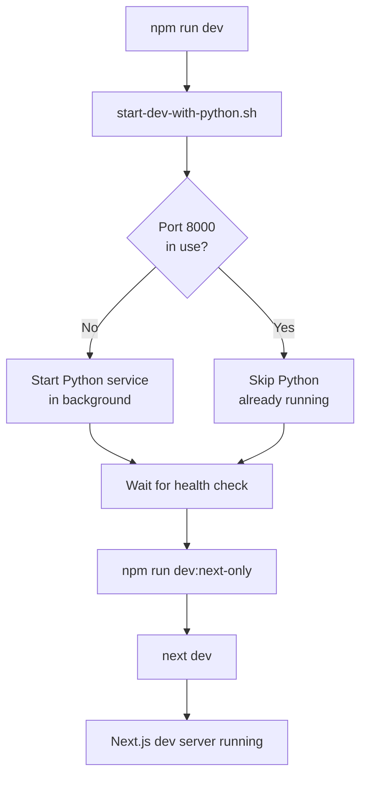

# Infinite Loop Fix - npm run dev

**Date:** January 7, 2026  
**Issue:** `npm run dev` entered infinite loop when trying to restart  
**Status:** ✅ Fixed

---

## The Problem

After updating `package.json` to make `npm run dev` call `start-dev-with-python.sh`, an infinite recursion loop was created:

### Infinite Loop Flow

```
npm run dev
  ↓
./scripts/start-dev-with-python.sh (line 1)
  ↓
starts Python service
  ↓
npm run dev (line 82) ← PROBLEM: calls itself!
  ↓
./scripts/start-dev-with-python.sh (line 1)
  ↓
... repeats forever
```

### What Happened

```bash
# package.json
"dev": "./scripts/start-dev-with-python.sh"

# start-dev-with-python.sh (line 82)
npm run dev  # ← This calls the script again!
```

---

## The Fix

Changed line 82 in `start-dev-with-python.sh` to call `npm run dev:next-only` instead:

### Before (Broken)
```bash
# Start Next.js in foreground
cd "$PROJECT_ROOT"
npm run dev  # ← Infinite loop!
```

### After (Fixed)
```bash
# Start Next.js in foreground
cd "$PROJECT_ROOT"
npm run dev:next-only  # ← Calls "next dev" directly
```

---

## How It Works Now



### Script Relationships

```json
{
  "dev": "./scripts/start-dev-with-python.sh",     // Full startup (Python + Next.js)
  "dev:next-only": "next dev",                      // Just Next.js
  "dev-full": "./scripts/start-full-dev.sh"         // Full stack (Python + Cloudflare + Next.js)
}
```

- `npm run dev` → starts Python, then calls `npm run dev:next-only`
- `npm run dev:next-only` → starts Next.js only (no recursion)
- `npm run dev-full` → independent script (no conflict)

---

## Testing

```bash
# Kill any existing processes
npm run dev-kill

# Test the fixed startup
npm run dev

# Should see:
# 1. Starting Python service
# 2. Waiting for health check
# 3. Starting Next.js dev server
# 4. No infinite loop!
```

---

## Related Files

- [`scripts/start-dev-with-python.sh`](../scripts/start-dev-with-python.sh) - Fixed (line 82)
- [`package.json`](../package.json) - Script definitions

---

## Lesson Learned

When creating wrapper scripts that use `npm run`, be careful not to create circular dependencies:

✅ **Good:**
```bash
# In wrapper script
npm run dev:next-only  # Calls a different script
```

❌ **Bad:**
```bash
# In wrapper script
npm run dev  # Calls itself = infinite loop!
```

