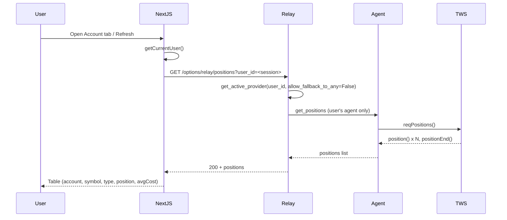

# UI for Existing Positions and Risk Management

## Current state

- **Portfolio page** ([app/portfolio/page.tsx](app/portfolio/page.tsx)) shows **manual** M&A positions from the DB (Prisma `portfolioPosition`): deal-centric (ticker, shares, entry, P&L, spread, IRR). Not live TWS data.
- **MA Options** ([app/ma-options/page.tsx](app/ma-options/page.tsx), [components/ma-options/MAOptionsContent.tsx](components/ma-options/MAOptionsContent.tsx)) has two tabs: **Curate** and **Monitor** (watched spreads). No UI calls the existing [GET /api/ib-connection/positions](app/api/ib-connection/positions/route.ts) or place-order/cancel-order APIs.
- **Position payload** from the agent (see [ib_scanner.py](python-service/standalone_agent/ib_scanner.py) `position()` / `_contract_to_dict`): each item has `account`, `contract` (symbol, secType, exchange, currency, strike, right, lastTradeDateOrContractMonth, etc.), `position` (size), `avgCost`.
- **Permission model** is already enforced: positions and orders are strictly own-account; quotes can use any connected agent (see [docs/IB_LIVE_TESTING_AND_POSITIONS_ORDERS.md](docs/IB_LIVE_TESTING_AND_POSITIONS_ORDERS.md)).

---

## 1. Where to show “existing positions” (live IB)

**Recommendation: New tab inside M&A Options (“Account” or “Positions”), not a separate app-wide page.**

- Keeps all **live trading** (scanner, watched spreads, **live positions**, and later order entry) in one place (`/ma-options`).
- Avoids mixing two different concepts on the existing Portfolio page: (1) manual M&A book (DB) vs (2) live TWS positions (agent/relay).
- Reuses [IBConnectionStatus](components/ma-options/IBConnectionStatus.tsx) and [IBConnectionContext](components/ma-options/IBConnectionContext.tsx): when the user’s agent is disconnected, the positions tab can show an empty state with “Connect your agent to see live positions” and a link to download/start the agent.

**Implementation:**

- Add a third tab to [OptionsScannerTabs](components/ma-options/OptionsScannerTabs.tsx) (e.g. **Account** or **Positions**).
- New client component (e.g. `IBPositionsTab.tsx` or `AccountTab.tsx`) that:
  - Calls `GET /api/ib-connection/positions` (session auth; backend passes current user’s `user_id` to relay).
  - Renders a compact table: **Account** | **Symbol** (contract.symbol / localSymbol) | **Type** (secType) | **Position** (size; right-aligned) | **Avg cost** (right-aligned, 2 decimals). Optional: **Contract** (e.g. expiry/strike for OPT/FUT).
  - Handles loading, empty list, and error (e.g. 503 “Your agent is not connected”) with a short message and refresh button.
  - Uses high-density styling per [docs/krj_ui_style.md](docs/krj_ui_style.md): compact rows, right-aligned numerics, dark theme, minimal chrome.
- Optional: **Refresh** button and/or auto-refresh (e.g. every 30–60s) only when the tab is active, to avoid unnecessary relay traffic.

---

## 2. Risk management – what fits this codebase

**Interpretation of “risk management” here:**

- **Pre-trade:** Confirm orders before sending; optional what-if (commission/margin) — backend already supports `whatIf` in [place_order](python-service/standalone_agent/ib_data_agent.py).
- **Visibility:** Show live positions (above) and, optionally, a simple **exposure summary** (e.g. notional or position count by symbol or secType) so the user can see concentration at a glance.
- **Post-trade:** After place/cancel, refetch positions so the list stays accurate; show order success/error clearly.

**Not in scope unless you request it:** Configurable position limits, P&L stop-outs, or margin alerts (would require account summary from IB and possibly new backend/agent support).

**Concrete UI elements:**

| Area                    | Recommendation                                                                                                                                                                                                                                                                                                                                                     |
| ----------------------- | ------------------------------------------------------------------------------------------------------------------------------------------------------------------------------------------------------------------------------------------------------------------------------------------------------------------------------------------------------------------ |
| **Order confirmation**  | When you add any “Place order” or “Cancel order” action (e.g. from a future order-entry form or from a position row), use a **confirmation step** before calling the API: show contract, action, quantity, order type, limit price (if any). Optionally call place-order with `whatIf: true` and show commission/margin in the same modal, then “Send” / “Cancel”. |
| **Exposure summary**    | On the same Account/Positions tab, optional **summary row(s)** above or below the table: e.g. “Positions: N total” and, if useful, “By type: STK x, OPT x, FUT x” or “By symbol: …” derived client-side from the positions list. No new backend.                                                                                                                   |
| **Refetch after order** | After a successful place-order or cancel-order, trigger a positions refetch in the Account tab so the table updates.                                                                                                                                                                                                                                               |

---

## 3. Order entry (minimal, for completeness)

There is **no UI yet** that calls place-order or cancel-order. To support “send orders for their own account” in the UI:

- Add a **minimal order flow** only where it’s needed (e.g. “Close” or “Sell” from a position row, or a small “Place order” from the scanner/spread flow later). For the **positions + risk** scope, the minimum is:
  - **Cancel order:** If you later show open orders, a “Cancel” button that calls `POST /api/ib-connection/cancel-order` with `orderId`, after a confirmation modal.
  - **Place order:** When you add it, use a form (contract, action, quantity, order type, limit) and a **confirmation modal** (with optional what-if) before `POST /api/ib-connection/place-order`.

So: **positions screen first**; **order confirmation** (and optional what-if) when any order-entry or cancel action is added.

---

## 4. Data flow (recap)

---

## 5. Suggested implementation order

1. **Account/Positions tab** – New tab in OptionsScannerTabs; new component that fetches and displays live IB positions; empty/error states; refresh (and optional auto-refresh when tab active).
2. **Exposure summary (optional)** – On the same tab, client-side summary (count by secType or symbol) above or below the table.
3. **Order confirmation** – When adding any “Place order” or “Cancel order” action, introduce a confirmation modal; optionally integrate what-if preview from the existing backend.

This keeps the architecture aligned with the permission model (users only see and trade their own account), uses existing APIs, and adds a clear place for risk visibility (positions + optional exposure) and safe order submission (confirmation + optional what-if).