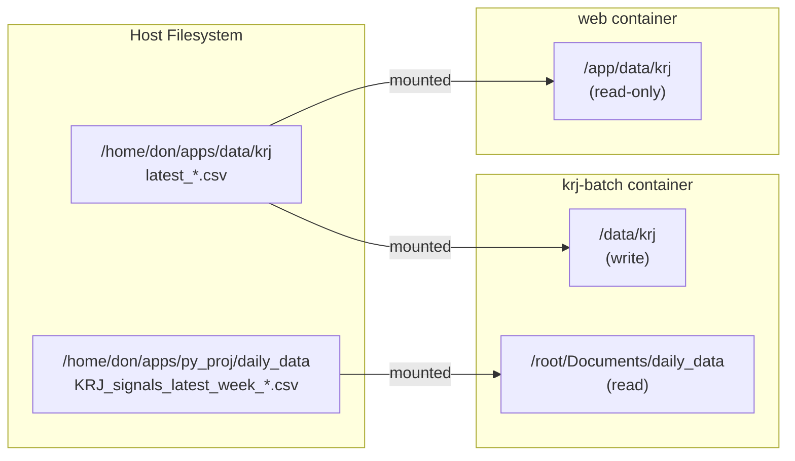
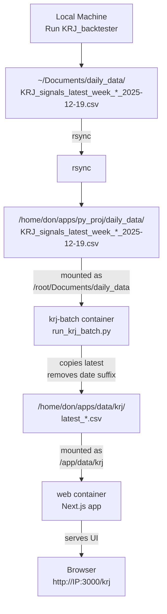

# KRJ Deployment – dr3-ma-dev

This document describes how the KRJ dashboard is deployed on the `dr3-ma-dev` DigitalOcean droplet, and how the Python KRJ pipeline and Next.js UI work together.

**For technical architecture details, see:** [`docs/KRJ_DEPLOYMENT_ARCHITECTURE.md`](docs/KRJ_DEPLOYMENT_ARCHITECTURE.md)

---

## Table of Contents

- [High-Level Architecture](#high-level-architecture)
- [Directory Layout](#directory-layout-on-dr3-ma-dev)
- [Docker Services](#docker-services)
- [Volume Mounts](#volume-mounts)
- [Data Flow](#data-flow)
- [Weekly Update Workflow](#weekly-update-workflow)
- [Common Operations](#common-operations)
- [Environment Variables](#environment-variables)
- [Troubleshooting](#troubleshooting)
- [Future Enhancements](#future-enhancements)

---

## High-Level Architecture

The KRJ deployment uses a **copy-only architecture** with two Docker services orchestrated by `docker-compose`:

### 1. Python KRJ Engine (`py_proj`)

- Generates and stores all historical daily data and `KRJ_signals_latest_week_*.csv` files
- **Server mode:** Copy-only (does NOT run full backtester)
  - KRJ signals are generated on Don's local machine
  - The `daily_data/` directory is rsynced to the droplet
  - A batch job (`krj-batch` container) copies the latest weekly CSVs to a shared volume

### 2. Next.js App (`ma-tracker-app`)

- Serves the KRJ dashboard at `/krj` and the M&A options scanner at `/ma-options`
- Runs in Docker container (`ma-tracker-app-web`) on the droplet
- Reads CSVs from `/app/data/krj/latest_*.csv` inside the container (backed by host volume)
- Protected by basic auth (see `middleware.ts`)

**Everything is orchestrated via `docker-compose` from `/home/don/apps`**

---

## Directory Layout on `dr3-ma-dev`

Complete directory structure on the droplet:

```bash
/home/don/apps/
├── docker-compose.yml          # Orchestrates web + krj-batch services
├── data/
│   └── krj/                    # Shared volume: CSVs read by Next.js
│       ├── latest_equities.csv
│       ├── latest_etfs_fx.csv
│       ├── latest_sp500.csv
│       └── latest_sp100.csv
├── ma-tracker-app/             # Next.js App Router project
│   ├── Dockerfile              # Node 22, npm install, npm run dev
│   ├── app/
│   │   ├── krj/               # KRJ dashboard route
│   │   │   └── page.tsx       # Reads from /app/data/krj/*.csv
│   │   ├── ma-options/        # M&A options scanner route
│   │   └── ...
│   ├── middleware.ts          # Basic auth for /krj
│   ├── .env.local             # KRJ_BASIC_USER, KRJ_BASIC_PASS
│   └── ...
└── py_proj/                    # Python KRJ project
    ├── Dockerfile              # Python image for krj-batch
    ├── run_krj_batch.py        # Copy-only batch script
    └── daily_data/             # All historical daily + weekly KRJ_signals
        ├── KRJ_signals_latest_week_Equities_2025-12-19.csv
        ├── KRJ_signals_latest_week_ETFs_and_FX_2025-12-19.csv
        ├── KRJ_signals_latest_week_SP500_2025-12-19.csv
        ├── KRJ_signals_latest_week_SP100_2025-12-19.csv
        └── ... (other historical data)
```

---

## Docker Services

### Service 1: `web` (Next.js)

**Purpose:** Serves the KRJ dashboard and M&A options scanner UI

**Configuration:**
```yaml
service: web
image: ma-tracker-app-dev
container_name: ma-tracker-app-web
ports: "3000:3000"
working_dir: /app
volumes:
  - ./data/krj:/app/data/krj
command: npm run dev
```

**Key Details:**
- Built from `ma-tracker-app/Dockerfile`
- Runs continuously (`docker compose up -d web`)
- Accessible at `http://<DROPLET_IP>:3000`
- KRJ dashboard at `http://<DROPLET_IP>:3000/krj`
- Basic auth required for `/krj` route

### Service 2: `krj-batch` (Python)

**Purpose:** Copies latest weekly KRJ signals to shared volume

**Configuration:**
```yaml
service: krj-batch
image: krj-batch
container_name: krj-batch
restart: "no"
environment:
  - KRJ_DATA_DIR=/root/Documents/daily_data
  - KRJ_OUTPUT_DIR=/data/krj
volumes:
  - ./data/krj:/data/krj
  - ./py_proj/daily_data:/root/Documents/daily_data
command: python -u run_krj_batch.py
```

**Key Details:**
- Built from `py_proj/Dockerfile`
- Runs on-demand only (`docker compose run --rm krj-batch`)
- Does NOT run continuously
- Exits after copying files

---

## Volume Mounts

Understanding the volume mount strategy is critical for debugging:

### Web Service Mounts

| Host Path | Container Path | Purpose |
|-----------|----------------|---------|
| `./data/krj` | `/app/data/krj` | Next.js reads `latest_*.csv` from here |

### KRJ-Batch Service Mounts

| Host Path | Container Path | Purpose |
|-----------|----------------|---------|
| `./data/krj` | `/data/krj` | Batch writes `latest_*.csv` here |
| `./py_proj/daily_data` | `/root/Documents/daily_data` | Batch reads `KRJ_signals_latest_week_*` from here |

### Volume Mount Diagram



---

## Data Flow

### End-to-End Data Flow



### File Naming Convention

**Input files** (in `py_proj/daily_data/`):
- `KRJ_signals_latest_week_Equities_YYYY-MM-DD.csv`
- `KRJ_signals_latest_week_ETFs_and_FX_YYYY-MM-DD.csv`
- `KRJ_signals_latest_week_SP500_YYYY-MM-DD.csv`
- `KRJ_signals_latest_week_SP100_YYYY-MM-DD.csv`

**Output files** (in `data/krj/`):
- `latest_equities.csv`
- `latest_etfs_fx.csv`
- `latest_sp500.csv`
- `latest_sp100.csv`

**Copy logic:** For each category, the batch script selects the lexicographically latest (newest date) file and copies it with the simplified name.

---

## Weekly Update Workflow

### Step-by-Step Process

#### 1. Generate Signals Locally

On your local development machine:

```bash
# Run the full KRJ backtester
cd ~/Documents/py_proj
python run_krj_backtester.py

# This generates:
# ~/Documents/daily_data/KRJ_signals_latest_week_Equities_YYYY-MM-DD.csv
# ~/Documents/daily_data/KRJ_signals_latest_week_ETFs_and_FX_YYYY-MM-DD.csv
# ~/Documents/daily_data/KRJ_signals_latest_week_SP500_YYYY-MM-DD.csv
# ~/Documents/daily_data/KRJ_signals_latest_week_SP100_YYYY-MM-DD.csv
```

#### 2. Rsync to Server

Upload the updated `daily_data/` directory to the droplet:

```bash
# From local machine
rsync -avz --progress \
  ~/Documents/daily_data/ \
  don@<DROPLET_IP>:/home/don/apps/py_proj/daily_data/
```

**Note:** This syncs ALL files in `daily_data/`, including historical data. If you only want to sync the latest week, use:

```bash
rsync -avz --progress \
  ~/Documents/daily_data/KRJ_signals_latest_week_*.csv \
  don@<DROPLET_IP>:/home/don/apps/py_proj/daily_data/
```

#### 3. Run Batch Job on Server

SSH into the droplet and run the batch container:

```bash
# SSH to droplet
ssh don@<DROPLET_IP>

# Navigate to apps directory
cd /home/don/apps

# Run the batch job
docker compose run --rm krj-batch

# Expected output:
# Found latest Equities file: KRJ_signals_latest_week_Equities_2025-12-19.csv
# Copying to /data/krj/latest_equities.csv
# Found latest ETFs_and_FX file: KRJ_signals_latest_week_ETFs_and_FX_2025-12-19.csv
# Copying to /data/krj/latest_etfs_fx.csv
# ... (etc)
```

#### 4. Verify Update

The web service automatically picks up the new files (no restart needed):

```bash
# Check file timestamps
ls -lh /home/don/apps/data/krj/

# Access the dashboard
# Open browser: http://<DROPLET_IP>:3000/krj
# Verify the date/data looks correct
```

---

## Deployment Workflow

### Quick Deployment (Component/Code Changes)

**Use this for:** UI changes, component updates, styling changes

```bash
# 1. Sync changed files to droplet
rsync -avz components/KrjTabsClient.tsx \
  don@134.199.204.12:/home/don/apps/ma-tracker-app/components/

# 2. Rebuild Docker image (use --no-cache to ensure changes are picked up)
ssh don@134.199.204.12 "cd /home/don/apps/ma-tracker-app && docker build --no-cache -t ma-tracker-app-dev -f Dockerfile ."

# 3. Recreate container with new image
ssh don@134.199.204.12 "cd /home/don/apps && docker compose down web && docker compose up -d web"

# 4. Verify deployment
ssh don@134.199.204.12 "cd /home/don/apps && docker compose ps"
ssh don@134.199.204.12 "cd /home/don/apps && docker compose logs web --tail 20"

# 5. Test in browser (use hard refresh: Cmd+Shift+R or Ctrl+Shift+R)
# URL: http://134.199.204.12:3000/krj
```

**⚠️ Important:** Always use **hard refresh** (Cmd+Shift+R / Ctrl+Shift+R) or incognito window when testing to avoid browser cache issues.

### Full Deployment (Multiple Files or Dependencies)

**Use this for:** Multiple file changes, dependency updates, major refactors

```bash
# 1. Sync entire app directory (excluding node_modules, .next, .git)
rsync -avz --exclude 'node_modules' --exclude '.next' --exclude '.git' \
  /Users/donaldross/dev/ma-tracker-app/ \
  don@134.199.204.12:/home/don/apps/ma-tracker-app/

# 2. Rebuild with no cache
ssh don@134.199.204.12 "cd /home/don/apps/ma-tracker-app && docker build --no-cache -t ma-tracker-app-dev -f Dockerfile ."

# 3. Recreate container
ssh don@134.199.204.12 "cd /home/don/apps && docker compose down web && docker compose up -d web"

# 4. Verify
ssh don@134.199.204.12 "cd /home/don/apps && docker compose logs web --tail 30"
```

### Batch Script Deployment

**Use this for:** Changes to `run_krj_batch.py` or batch processing logic

```bash
# 1. Sync batch script
rsync -avz scripts/run_krj_batch.py \
  don@134.199.204.12:/home/don/apps/py_proj/

# 2. Rebuild krj-batch image
ssh don@134.199.204.12 "cd /home/don/apps && docker compose build krj-batch"

# 3. Run batch script to test
ssh don@134.199.204.12 "cd /home/don/apps && docker compose run --rm krj-batch"

# 4. Verify metadata.json was generated
ssh don@134.199.204.12 "cat /home/don/apps/data/krj/metadata.json"
```

### Deployment Checklist

**Before deploying:**
- [ ] Test changes locally (`npm run dev` on Mac)
- [ ] Verify no TypeScript errors (`npm run build`)
- [ ] Check linter warnings
- [ ] Review changed files

**After deploying:**
- [ ] Check container status (`docker compose ps`)
- [ ] Review logs for errors (`docker compose logs web --tail 20`)
- [ ] Test in browser with **hard refresh** (Cmd+Shift+R)
- [ ] Verify changes across all tabs (if applicable)
- [ ] Test in incognito window if cache issues suspected

### Common Deployment Issues

**Issue: Changes not visible in browser**
- **Cause:** Browser cache
- **Fix:** Hard refresh (Cmd+Shift+R / Ctrl+Shift+R) or use incognito window
- **Verify server-side:** `curl -s http://134.199.204.12:3000/krj | grep "your-new-class"`

**Issue: Container not picking up changes**
- **Cause:** Docker build cache
- **Fix:** Use `--no-cache` flag when building: `docker build --no-cache ...`
- **Verify:** Check file timestamp on server, ensure it's recent

**Issue: Container restarts but shows old code**
- **Cause:** Container using old image
- **Fix:** Use `docker compose down web` then `docker compose up -d web` (not just `restart`)
- **Verify:** Check image hash in `docker compose ps` output

**Issue: TypeScript errors in production**
- **Cause:** Missing types or incomplete features
- **Fix:** Check `next.config.ts` has `typescript: { ignoreBuildErrors: true }`
- **Note:** Only use for non-critical features; fix errors for production code

---

## Common Operations

### Starting Services

```bash
# Start web service (runs continuously)
cd /home/don/apps
docker compose up -d web

# Check status
docker compose ps

# View logs
docker compose logs -f web
```

### Stopping Services

```bash
# Stop web service
docker compose stop web

# Stop and remove containers
docker compose down
```

### Updating KRJ Signals

```bash
# After rsync (see workflow above)
docker compose run --rm krj-batch
```

### Rebuilding Images

If you've changed the Dockerfile or code:

```bash
# Rebuild web image
docker compose build web

# Rebuild krj-batch image
docker compose build krj-batch

# Rebuild and restart
docker compose up -d --build web
```

### Viewing Logs

```bash
# Follow web logs
docker compose logs -f web

# View last 100 lines
docker compose logs --tail=100 web

# View krj-batch logs (last run)
docker compose logs krj-batch
```

### Accessing Container Shell

```bash
# Shell into web container
docker compose exec web /bin/bash

# Shell into krj-batch container (if running)
docker compose run --rm krj-batch /bin/bash
```

---

## Environment Variables

### Required Variables

Set in `/home/don/apps/ma-tracker-app/.env.local`:

```bash
# Basic auth for /krj route
KRJ_BASIC_USER=your_username
KRJ_BASIC_PASS=your_password
```

### Optional Variables (krj-batch)

Set in `docker-compose.yml` under `krj-batch` service:

```yaml
environment:
  - KRJ_DATA_DIR=/root/Documents/daily_data  # Input directory
  - KRJ_OUTPUT_DIR=/data/krj                 # Output directory
```

**Defaults:** If not set, `run_krj_batch.py` uses the paths shown above.

---

## Troubleshooting

### Issue: KRJ Dashboard Shows Old Data

**Symptoms:** Dashboard displays outdated signals

**Diagnosis:**
```bash
# Check file timestamps
ls -lh /home/don/apps/data/krj/

# Check what's in py_proj/daily_data
ls -lh /home/don/apps/py_proj/daily_data/KRJ_signals_latest_week_*.csv
```

**Solution:**
1. Verify rsync completed successfully
2. Re-run batch job: `docker compose run --rm krj-batch`
3. Check batch logs for errors

### Issue: Batch Job Fails

**Symptoms:** `docker compose run --rm krj-batch` exits with error

**Diagnosis:**
```bash
# View batch logs
docker compose logs krj-batch

# Check if input files exist
docker compose run --rm krj-batch ls -lh /root/Documents/daily_data/
```

**Common causes:**
- Input files missing (rsync didn't complete)
- Incorrect file naming (must match `KRJ_signals_latest_week_*`)
- Permission issues (unlikely with Docker volumes)

### Issue: Web Service Won't Start

**Symptoms:** `docker compose up -d web` fails or container exits immediately

**Diagnosis:**
```bash
# Check logs
docker compose logs web

# Check if port 3000 is in use
netstat -tuln | grep 3000

# Check if image exists
docker images | grep ma-tracker-app-dev
```

**Solution:**
1. Rebuild image: `docker compose build web`
2. Check for port conflicts
3. Verify `.env.local` exists with required variables

### Issue: Can't Access Dashboard

**Symptoms:** Browser can't reach `http://<DROPLET_IP>:3000/krj`

**Diagnosis:**
```bash
# Check if container is running
docker compose ps

# Check if port is exposed
docker compose port web 3000

# Test from droplet
curl http://localhost:3000/krj
```

**Solution:**
1. Verify firewall allows port 3000
2. Check DigitalOcean firewall rules
3. Verify basic auth credentials are correct

### Issue: Basic Auth Not Working

**Symptoms:** Can't log in to `/krj` route

**Diagnosis:**
```bash
# Check if .env.local exists
cat /home/don/apps/ma-tracker-app/.env.local

# Check middleware is loaded
docker compose exec web cat /app/middleware.ts
```

**Solution:**
1. Verify `KRJ_BASIC_USER` and `KRJ_BASIC_PASS` are set in `.env.local`
2. Restart web service: `docker compose restart web`
3. Check browser isn't caching old auth

---

## Future Enhancements

### 1. Production Dockerfile

**Current:** Running `npm run dev` (development mode)

**Planned:**
- Create optimized production build
- Multi-stage Dockerfile
- Smaller image size
- Better performance

### 2. Automated Scheduling

**Current:** Manual batch job execution

**Planned:**
- Cron job to run `krj-batch` weekly (e.g., Saturday mornings)
- Email notifications on success/failure
- Automatic rsync from local machine (or move backtester to server)

### 3. M&A Options Scanner Python Service

**Current:** Options scanner runs in Next.js

**Planned:**
- Add third Docker service for options analysis
- Similar architecture to `krj-batch`
- Real-time options chain fetching

### 4. Domain + Cloudflare

**Current:** Direct IP access on port 3000

**Planned:**
- Domain name (e.g., `krj.yourdomain.com`)
- Cloudflare Tunnel or reverse proxy
- HTTPS with SSL certificate
- Remove port from URL

### 5. Monitoring & Alerts

**Planned:**
- Health check endpoints
- Uptime monitoring
- Disk space alerts (CSV files grow over time)
- Performance metrics

---

## Additional Resources

- **Technical Architecture:** [`docs/KRJ_DEPLOYMENT_ARCHITECTURE.md`](docs/KRJ_DEPLOYMENT_ARCHITECTURE.md)
- **KRJ UI Style Guide:** [`docs/krj_ui_style.md`](docs/krj_ui_style.md)
- **Main Architecture:** [`docs/ARCHITECTURE.md`](docs/ARCHITECTURE.md)
- **Cursor Rules:** [`.claude-rules`](.claude-rules) (includes KRJ quick reference)

---

*Last updated: 2025-12-25*
*Current deployed week: 2025-12-19*