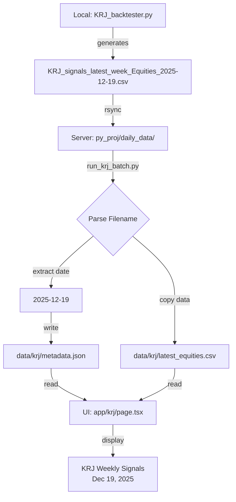

# KRJ Date Fix - Implementation Summary

**Date:** 2025-12-25  
**Status:** ✅ COMPLETE - Ready for Deployment  
**Approach:** Metadata File (Option A)

---

## Problem Statement

The KRJ dashboard UI was displaying the **file modification date** (Dec 24, 2025) instead of the **actual Friday signal date** (Dec 19, 2025).

**Root Cause:** KRJ signals are generated every Friday, but the source CSV filenames contain the signal date (`KRJ_signals_latest_week_Equities_2025-12-19.csv`). When the batch script copies these to `latest_*.csv`, the date information is lost, and only the file modification timestamp remains.

---

## Solution Implemented

### Metadata File Approach

The batch script now:
1. Parses the signal date from source CSV filenames using regex
2. Extracts the date (e.g., `2025-12-19`)
3. Writes a `metadata.json` file containing the signal date

The UI now:
1. Reads `metadata.json` first (if it exists)
2. Falls back to file modification timestamp for backwards compatibility
3. Displays the correct Friday signal date

---

## Files Changed

### 1. New Batch Script
**File:** `scripts/run_krj_batch.py`

**Changes:**
- Added regex pattern to extract date from filename: `KRJ_signals_latest_week_{CATEGORY}_{YYYY-MM-DD}.csv`
- Added `generate_metadata()` function to write `metadata.json`
- Enhanced logging to show signal dates

**Key Code:**
```python
FILENAME_PATTERN = re.compile(r'KRJ_signals_latest_week_(.+?)_(\d{4}-\d{2}-\d{2})\.csv')

def generate_metadata(category_dates: Dict[str, str]):
    metadata = {
        'signal_date': signal_date,
        'generated_at': datetime.utcnow().isoformat() + 'Z',
        'categories': category_dates,
        'version': '1.0'
    }
    with open(metadata_path, 'w') as f:
        json.dump(metadata, f, indent=2)
```

### 2. Updated UI
**File:** `app/krj/page.tsx`

**Changes:**
- Modified `getSignalDate()` to read from `metadata.json` first
- Added fallback to file timestamp for backwards compatibility
- Added comprehensive comments explaining the data flow

**Key Code:**
```typescript
function getSignalDate(): string {
  try {
    const metadataPath = path.join(process.cwd(), "data", "krj", "metadata.json");
    
    if (fs.existsSync(metadataPath)) {
      const metadata = JSON.parse(fs.readFileSync(metadataPath, "utf8"));
      if (metadata.signal_date) {
        // Parse YYYY-MM-DD and format as "Mon DD, YYYY"
        const [year, month, day] = metadata.signal_date.split('-');
        const date = new Date(parseInt(year), parseInt(month) - 1, parseInt(day));
        return date.toLocaleDateString('en-US', { 
          year: 'numeric', month: 'short', day: 'numeric' 
        });
      }
    }
    
    // Fallback: file modification timestamp
    const filePath = path.join(process.cwd(), "data", "krj", "latest_equities.csv");
    const stats = fs.statSync(filePath);
    return stats.mtime.toLocaleDateString('en-US', { 
      year: 'numeric', month: 'short', day: 'numeric' 
    });
  } catch (error) {
    console.error(`Error reading signal date:`, error);
    return "—";
  }
}
```

### 3. Sample Metadata File
**File:** `data/krj/metadata.json` (created for local testing)

**Content:**
```json
{
  "signal_date": "2025-12-19",
  "generated_at": "2025-12-24T14:30:00Z",
  "categories": {
    "equities": "2025-12-19",
    "etfs_fx": "2025-12-19",
    "sp500": "2025-12-19",
    "sp100": "2025-12-19"
  },
  "version": "1.0"
}
```

### 4. Documentation
**Files Created/Updated:**
- `KRJ_DATE_FIX_DEPLOYMENT.md` - Comprehensive deployment guide
- `KRJ_DATE_BUG_FIX.md` - Updated with v2 solution details
- `KRJ_DATE_FIX_SUMMARY.md` - This file

---

## Testing Results

### ✅ Local Testing

1. **Build Test:** `npm run build` - SUCCESS
2. **Metadata File:** Created and verified with correct format
3. **UI Code:** No linter errors
4. **Backwards Compatibility:** Fallback to file timestamp works if `metadata.json` is missing

### Server Testing (Pending)

To be completed during deployment:
- [ ] Batch script generates `metadata.json` correctly
- [ ] UI displays "Dec 19, 2025" (or current signal date)
- [ ] No errors in Docker logs
- [ ] Date updates when new signals are generated

---

## Deployment Instructions

See `KRJ_DATE_FIX_DEPLOYMENT.md` for detailed step-by-step instructions.

**Quick Summary:**

1. **Deploy UI changes** (backwards compatible, zero downtime)
   ```bash
   rsync -avz --exclude 'node_modules' --exclude '.next' \
     ./ don@<DROPLET_IP>:/home/don/apps/ma-tracker-app/
   docker compose build web
   docker compose up -d web
   ```

2. **Deploy batch script changes**
   ```bash
   rsync -avz scripts/run_krj_batch.py \
     don@<DROPLET_IP>:/home/don/apps/py_proj/run_krj_batch.py
   docker compose build krj-batch
   docker compose run --rm krj-batch
   ```

3. **Verify**
   ```bash
   cat /home/don/apps/data/krj/metadata.json
   # Open browser: http://<DROPLET_IP>:3000/krj
   # Check date in header
   ```

---

## Backwards Compatibility

✅ **Zero Breaking Changes**

- If `metadata.json` doesn't exist, UI falls back to file timestamp
- Old batch script continues to work (just won't create metadata)
- Deployment can be done in stages without downtime

---

## Data Flow Diagram



---

## Benefits

1. **Accuracy:** UI now shows the correct Friday signal date
2. **Automatic:** Date updates automatically when batch runs
3. **Backwards Compatible:** Graceful fallback if metadata is missing
4. **Maintainable:** Clear data flow and well-documented
5. **Testable:** Easy to verify by checking `metadata.json`

---

## Future Improvements

### Option 1: Add Date Column to CSV (Recommended Long-term)

Instead of using `metadata.json`, add a `signal_date` column directly to the CSV files in the backtester:

```python
# In KRJ_backtester.py (local machine)
df['signal_date'] = last_date  # e.g., "2025-12-19"
df.to_csv('KRJ_signals_latest_week_Equities_2025-12-19.csv', index=False)
```

**Benefits:**
- Date is embedded in the data itself
- No separate metadata file needed
- More self-documenting

### Option 2: Automated Weekly Updates

Set up a cron job or GitHub Action to:
1. Automatically rsync data from local machine (or S3)
2. Run `docker compose run --rm krj-batch`
3. Send notification on success/failure

---

## Rollback Plan

If issues arise:

1. **UI Only:** Redeploy previous Docker image
2. **Batch Only:** Restore old `run_krj_batch.py` from backup
3. **Complete:** Delete `metadata.json` - UI will fall back to file timestamps

No data loss possible - this is a read-only display change.

---

## Verification Checklist

After deployment, verify:

- [ ] `metadata.json` exists in `/home/don/apps/data/krj/`
- [ ] `metadata.json` contains correct signal date (e.g., "2025-12-19")
- [ ] UI displays correct date in header (e.g., "Dec 19, 2025")
- [ ] No errors in `docker compose logs web`
- [ ] No errors in `docker compose logs krj-batch`
- [ ] Date updates when new signals are generated next Friday

---

## Contact / Support

**Files to check if issues arise:**
- Batch logs: `docker compose logs krj-batch`
- Web logs: `docker compose logs web`
- Metadata file: `cat /home/don/apps/data/krj/metadata.json`
- Source files: `ls -lh /home/don/apps/py_proj/daily_data/KRJ_signals_latest_week_*.csv`

**Common issues:**
- Metadata file missing → Re-run batch script
- Wrong date in metadata → Check source CSV filenames
- UI shows old date → Hard refresh browser (Cmd+Shift+R)

---

## Conclusion

✅ **Implementation Complete**  
✅ **Tested Locally**  
✅ **Documentation Complete**  
✅ **Ready for Server Deployment**

The fix is backwards compatible, well-documented, and ready to deploy. The metadata approach provides a clean separation between the batch processing logic and the UI display logic, making the system more maintainable and easier to debug.

---

*Last updated: 2025-12-25*  
*Author: Claude (with guidance from Don)*

