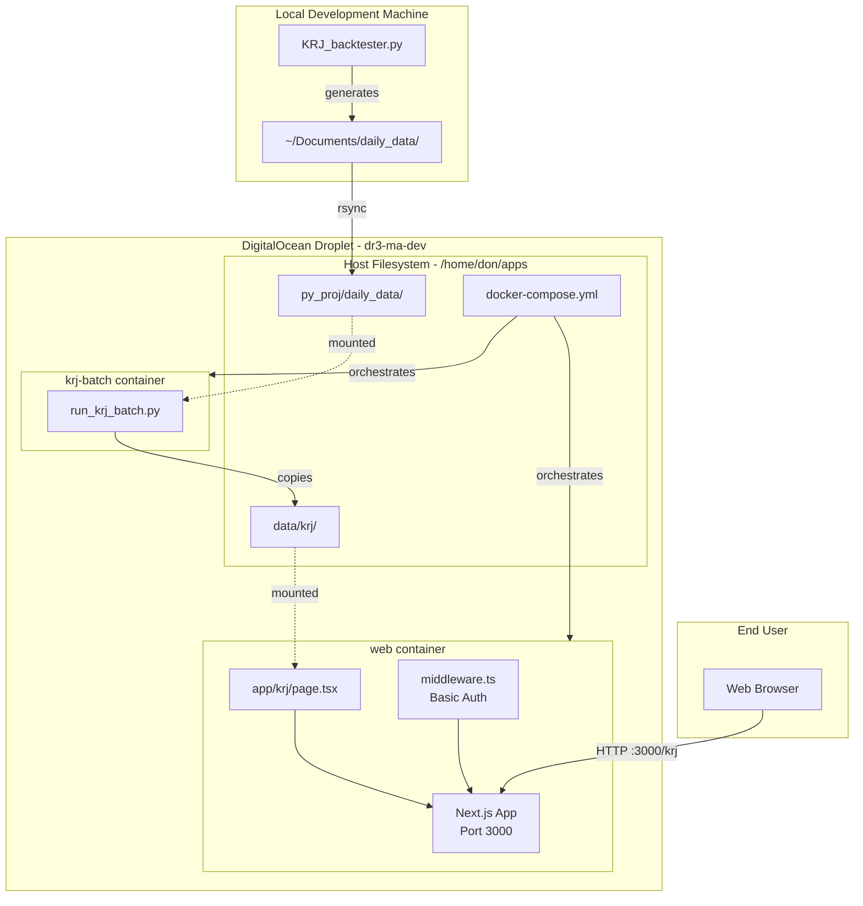
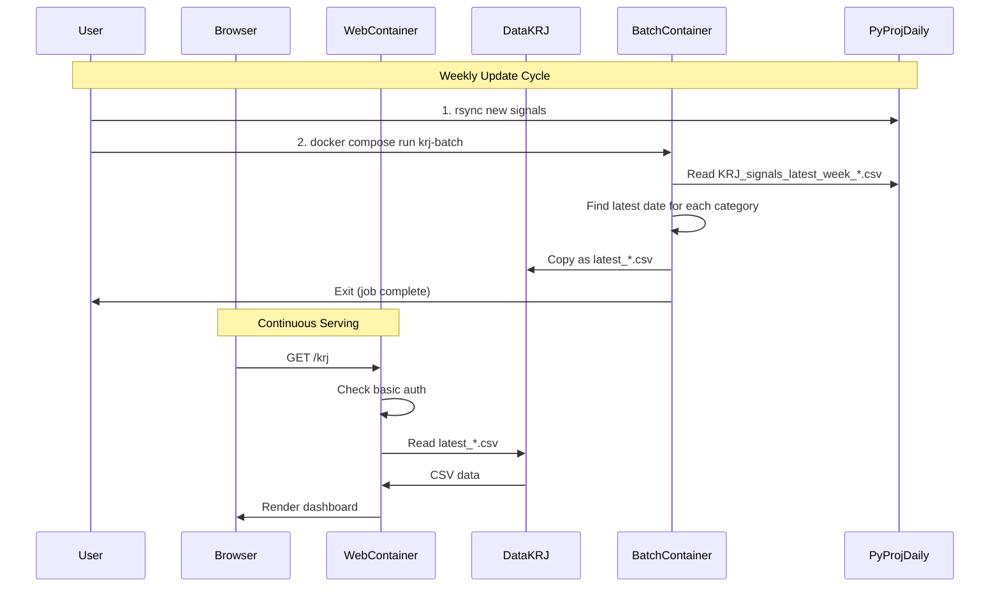
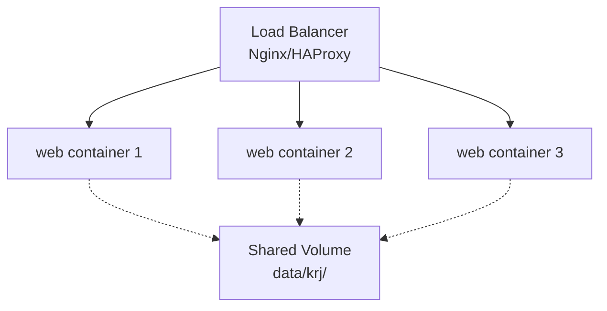

# KRJ Deployment Architecture

**Technical deep-dive into the KRJ dashboard deployment on DigitalOcean**

This document provides detailed architectural information about the KRJ deployment. For operational procedures, see [`DEPLOYMENT_KRJ.md`](../DEPLOYMENT_KRJ.md).

---

## Table of Contents

- [Architecture Overview](#architecture-overview)
- [Service Communication](#service-communication)
- [File System Layout](#file-system-layout)
- [Copy-Only Mode Rationale](#copy-only-mode-rationale)
- [Docker Configuration Details](#docker-configuration-details)
- [Security Architecture](#security-architecture)
- [Performance Characteristics](#performance-characteristics)
- [Development vs Production](#development-vs-production)
- [Scaling Considerations](#scaling-considerations)

---

## Architecture Overview

### High-Level System Diagram



### Design Principles

1. **Separation of Concerns**
   - Signal generation (local) vs serving (remote)
   - Batch processing vs continuous serving
   - Data storage vs data presentation

2. **Copy-Only Architecture**
   - Server does NOT run computationally expensive backtester
   - Pre-computed signals are copied, not regenerated
   - Reduces server resource requirements

3. **Shared Volume Pattern**
   - `data/krj/` acts as handoff point between services
   - Web service reads, batch service writes
   - No direct inter-container communication needed

4. **Stateless Batch Jobs**
   - Batch container runs on-demand, exits immediately
   - No persistent state in batch container
   - Idempotent operations (safe to re-run)

---

## Service Communication

### Communication Patterns



### No Direct Inter-Service Communication

**Key architectural decision:** The two services do NOT communicate directly.

- **web** service: Continuously running, reads from shared volume
- **krj-batch** service: Runs on-demand, writes to shared volume
- **Communication:** Via shared filesystem (`data/krj/`)

**Benefits:**
- Simple deployment (no service discovery needed)
- No network configuration between containers
- Easy to debug (just check files on disk)
- Batch can run while web is serving (no coordination needed)

**Trade-offs:**
- No real-time notification when data updates
- Web service must poll filesystem or rely on user refresh
- No validation that web service successfully reads new data

---

## File System Layout

### Host vs Container Paths

Understanding the path mapping is critical for debugging:

#### Web Container Path Mapping

| Host Path | Container Path | Purpose | Access |
|-----------|----------------|---------|--------|
| `/home/don/apps/data/krj/` | `/app/data/krj/` | CSV files | Read |
| `/home/don/apps/ma-tracker-app/` | `/app/` | Next.js code | Read/Write |

**Code reference in Next.js:**
```typescript
// app/krj/page.tsx reads from:
const csvPath = path.join(process.cwd(), 'data', 'krj', 'latest_equities.csv');
// process.cwd() = '/app' inside container
// Resolves to: /app/data/krj/latest_equities.csv
```

#### Batch Container Path Mapping

| Host Path | Container Path | Purpose | Access |
|-----------|----------------|---------|--------|
| `/home/don/apps/data/krj/` | `/data/krj/` | CSV output | Write |
| `/home/don/apps/py_proj/daily_data/` | `/root/Documents/daily_data/` | CSV input | Read |

**Code reference in Python:**
```python
# run_krj_batch.py uses:
KRJ_DATA_DIR = os.getenv('KRJ_DATA_DIR', '/root/Documents/daily_data')
KRJ_OUTPUT_DIR = os.getenv('KRJ_OUTPUT_DIR', '/data/krj')
```

### Complete File System Diagram

```mermaid
graph TB
    subgraph Host [Host: /home/don/apps]
        HostDataKRJ[data/krj/<br/>latest_equities.csv<br/>latest_etfs_fx.csv<br/>latest_sp500.csv<br/>latest_sp100.csv]
        HostPyProj[py_proj/daily_data/<br/>KRJ_signals_latest_week_Equities_2025-12-19.csv<br/>KRJ_signals_latest_week_ETFs_and_FX_2025-12-19.csv<br/>KRJ_signals_latest_week_SP500_2025-12-19.csv<br/>KRJ_signals_latest_week_SP100_2025-12-19.csv]
        HostMATracker[ma-tracker-app/<br/>app/krj/page.tsx<br/>middleware.ts<br/>.env.local]
    end
    
    subgraph WebCont [web container]
        WebApp[/app/<br/>Next.js code]
        WebData[/app/data/krj/<br/>CSVs]
    end
    
    subgraph BatchCont [krj-batch container]
        BatchInput[/root/Documents/daily_data/<br/>Input CSVs]
        BatchOutput[/data/krj/<br/>Output CSVs]
    end
    
    HostDataKRJ -.->|volume mount| WebData
    HostDataKRJ -.->|volume mount| BatchOutput
    HostPyProj -.->|volume mount| BatchInput
    HostMATracker -.->|COPY in Dockerfile| WebApp
```

### File Naming Transformation

The batch script transforms file names to remove date suffixes:

**Input pattern:**
```
KRJ_signals_latest_week_{CATEGORY}_{YYYY-MM-DD}.csv
```

**Output pattern:**
```
latest_{category}.csv
```

**Transformation logic:**
1. List all files matching `KRJ_signals_latest_week_{CATEGORY}_*.csv`
2. Sort lexicographically (latest date sorts last)
3. Select the last file (newest date)
4. Copy to `latest_{category}.csv` (lowercase, no date)

**Example:**
```python
# Input files:
KRJ_signals_latest_week_Equities_2025-12-12.csv
KRJ_signals_latest_week_Equities_2025-12-19.csv  # ← Latest
KRJ_signals_latest_week_Equities_2025-12-05.csv

# Output file:
latest_equities.csv  # ← Contains data from 2025-12-19
```

---

## Copy-Only Mode Rationale

### Why Not Run the Backtester on the Server?

**Decision:** The server runs a copy-only batch job instead of the full KRJ backtester.

#### Reasons for Copy-Only Mode

1. **Computational Resources**
   - Backtester is CPU/memory intensive
   - Requires significant historical data processing
   - Would need larger (more expensive) droplet

2. **Data Dependencies**
   - Backtester needs extensive historical market data
   - Data files are large (GBs of historical prices)
   - Syncing all data to server is inefficient

3. **Development Workflow**
   - Signal generation often requires parameter tuning
   - Easier to iterate locally with full IDE/debugging tools
   - Don already runs backtester weekly on local machine

4. **Separation of Concerns**
   - Research/development (local) vs production serving (remote)
   - Server focuses on high-availability serving
   - Local machine handles batch computation

5. **Cost Efficiency**
   - Small droplet sufficient for serving static CSVs
   - No need for high-CPU instance
   - Reduces monthly hosting costs

#### Trade-offs

**Advantages:**
- Lower server costs
- Simpler server setup
- Faster deployment (no large data sync)
- Development flexibility

**Disadvantages:**
- Manual workflow (rsync + batch run)
- Requires local machine to generate signals
- No automatic weekly updates (yet)
- Two-step deployment process

#### Future: Hybrid Approach

**Potential evolution:**
1. Keep copy-only for weekly signals (current workflow)
2. Add server-side backtester for on-demand analysis
3. Use local for research, server for production signals
4. Implement cron job to automate rsync + batch

---

## Docker Configuration Details

### docker-compose.yml Structure

**Conceptual structure** (actual file on server):

```yaml
version: '3.8'

services:
  web:
    image: ma-tracker-app-dev
    container_name: ma-tracker-app-web
    build:
      context: ./ma-tracker-app
      dockerfile: Dockerfile
    ports:
      - "3000:3000"
    volumes:
      - ./data/krj:/app/data/krj
    working_dir: /app
    command: npm run dev
    restart: unless-stopped
    environment:
      - NODE_ENV=development

  krj-batch:
    image: krj-batch
    container_name: krj-batch
    build:
      context: ./py_proj
      dockerfile: Dockerfile
    volumes:
      - ./data/krj:/data/krj
      - ./py_proj/daily_data:/root/Documents/daily_data
    environment:
      - KRJ_DATA_DIR=/root/Documents/daily_data
      - KRJ_OUTPUT_DIR=/data/krj
    command: python -u run_krj_batch.py
    restart: "no"  # Don't auto-restart; run on-demand only
```

### Dockerfile: ma-tracker-app (Web Service)

**Conceptual structure** (actual file in `ma-tracker-app/Dockerfile`):

```dockerfile
FROM node:22-bullseye

WORKDIR /app

# Copy package files
COPY package*.json ./

# Copy prisma schema (needed before npm install)
COPY prisma ./prisma

# Install dependencies (includes prisma generate)
RUN npm install

# Copy rest of application
COPY . .

# Expose port
EXPOSE 3000

# Start development server
CMD ["npm", "run", "dev"]
```

**Key points:**
- Uses Node 22 (latest LTS)
- Runs `npm run dev` (development mode)
- Prisma schema copied before install (for postinstall hook)
- All code copied into container (not volume-mounted)

### Dockerfile: py_proj (Batch Service)

**Conceptual structure** (actual file in `py_proj/Dockerfile`):

```dockerfile
FROM python:3.11-slim

WORKDIR /app

# Copy requirements
COPY requirements.txt .

# Install dependencies
RUN pip install --no-cache-dir -r requirements.txt

# Copy batch script
COPY run_krj_batch.py .

# Run batch script
CMD ["python", "-u", "run_krj_batch.py"]
```

**Key points:**
- Uses Python 3.11
- Minimal dependencies (just what's needed for file operations)
- `-u` flag for unbuffered output (better logging)
- Exits after completion

### Volume Mount Behavior

**Docker volume mounts are bidirectional:**
- Changes on host immediately visible in container
- Changes in container immediately visible on host
- No caching or delay (unlike COPY in Dockerfile)

**Implications:**
1. Batch writes to `/data/krj/` → immediately available on host
2. Host changes to `data/krj/` → immediately visible to web container
3. No container restart needed after batch updates files
4. Web service can read updated CSVs without restart

---

## Security Architecture

### Current Security Measures

#### 1. Basic Authentication

**Implementation:** `middleware.ts` in Next.js app

```typescript
// Protects /krj route with HTTP Basic Auth
// Credentials from .env.local:
// - KRJ_BASIC_USER
// - KRJ_BASIC_PASS
```

**Scope:** Only `/krj` route is protected (not entire app)

**Limitations:**
- Basic auth sends credentials with every request
- Not encrypted unless HTTPS is used
- Single shared credential (no per-user auth)

#### 2. Network Isolation

**Current setup:**
- Droplet accessible on port 3000 only
- No other ports exposed
- Docker containers on bridge network (isolated from host network)

**Firewall:** DigitalOcean firewall should restrict:
- Allow: Port 3000 (HTTP)
- Allow: Port 22 (SSH, for management)
- Deny: All other ports

#### 3. Environment Variables

**Sensitive data in `.env.local`:**
- `KRJ_BASIC_USER`
- `KRJ_BASIC_PASS`
- Database credentials (if any)

**Security:**
- `.env.local` not committed to git (in `.gitignore`)
- Only accessible on server filesystem
- Not exposed to client-side code

#### 4. Docker Isolation

**Container isolation:**
- Containers run as non-root user (best practice)
- Limited filesystem access (only mounted volumes)
- No privileged mode

### Security Improvements for Production

#### 1. HTTPS/SSL

**Current:** HTTP only (no encryption)

**Recommended:**
- Add Cloudflare Tunnel (automatic SSL)
- Or use Nginx reverse proxy with Let's Encrypt
- Encrypt all traffic (especially basic auth credentials)

#### 2. Proper Authentication

**Current:** Single shared basic auth credential

**Recommended:**
- Implement NextAuth.js
- Support multiple users with roles
- Use JWT tokens instead of basic auth
- Add session management

#### 3. Rate Limiting

**Current:** No rate limiting

**Recommended:**
- Add rate limiting middleware
- Prevent brute-force attacks on auth
- Limit API requests per IP

#### 4. Security Headers

**Recommended headers:**
```typescript
// Add to middleware.ts
headers: {
  'X-Frame-Options': 'DENY',
  'X-Content-Type-Options': 'nosniff',
  'Referrer-Policy': 'strict-origin-when-cross-origin',
  'Permissions-Policy': 'geolocation=(), microphone=(), camera=()'
}
```

#### 5. Secrets Management

**Current:** `.env.local` file on server

**Recommended for scale:**
- Use Docker secrets
- Or environment variables in docker-compose
- Or external secrets manager (AWS Secrets Manager, etc.)

---

## Performance Characteristics

### Current Performance Profile

#### Web Service (Next.js)

**Startup time:** ~5-10 seconds
- Node.js initialization
- Next.js compilation
- Prisma client generation

**Request latency:**
- CSV read: ~10-50ms (depends on file size)
- Page render: ~100-200ms (server-side rendering)
- Total response time: ~200-300ms

**Memory usage:**
- Base: ~150-200 MB
- Per request: +10-20 MB (garbage collected)
- Peak: ~300-400 MB

**CPU usage:**
- Idle: <1%
- During request: 5-10%
- Sustained load: Scales with concurrent requests

#### Batch Service (Python)

**Execution time:** ~1-5 seconds
- File discovery: <1s
- File copying: 1-3s (depends on CSV size)
- Total: Usually <5s

**Memory usage:** ~50-100 MB (minimal)

**CPU usage:** <5% (I/O bound, not CPU bound)

### Scalability Limits

#### Current Bottlenecks

1. **Single web instance**
   - No horizontal scaling
   - Limited to one droplet's resources
   - No load balancing

2. **CSV file I/O**
   - Disk read on every request
   - No caching layer
   - Could be slow with very large CSVs

3. **No CDN**
   - All requests hit origin server
   - No edge caching
   - Higher latency for distant users

#### Performance Optimizations (Future)

1. **CSV Caching**
   - Load CSVs into memory on startup
   - Watch for file changes, reload automatically
   - Reduce disk I/O per request

2. **Production Build**
   - Use `npm run build` + `npm start`
   - Pre-compiled pages (faster than dev mode)
   - Optimized bundles

3. **CDN Integration**
   - Cloudflare CDN
   - Cache static assets
   - Edge caching for API responses

4. **Database Migration**
   - Move CSV data to PostgreSQL
   - Indexed queries (faster than CSV parsing)
   - Better for large datasets

---

## Development vs Production

### Current: Development Mode

**Characteristics:**
- `npm run dev` (Next.js dev server)
- Hot module reloading
- Unoptimized bundles
- Verbose logging
- Slower performance

**Advantages:**
- Easy to debug
- Fast iteration (code changes reflect immediately)
- Detailed error messages

**Disadvantages:**
- Higher memory usage
- Slower request handling
- Not optimized for production traffic

### Future: Production Mode

**Planned changes:**

#### 1. Production Dockerfile

```dockerfile
# Multi-stage build
FROM node:22-bullseye AS builder
WORKDIR /app
COPY package*.json ./
COPY prisma ./prisma
RUN npm ci --only=production
COPY . .
RUN npm run build

FROM node:22-bullseye-slim
WORKDIR /app
COPY --from=builder /app/.next ./.next
COPY --from=builder /app/node_modules ./node_modules
COPY --from=builder /app/package.json ./package.json
EXPOSE 3000
CMD ["npm", "start"]
```

**Benefits:**
- Smaller image size
- Faster startup
- Better performance
- Production-optimized bundles

#### 2. Environment-Specific Configs

```yaml
# docker-compose.prod.yml
services:
  web:
    image: ma-tracker-app-prod
    environment:
      - NODE_ENV=production
    command: npm start  # Not npm run dev
    restart: always  # Auto-restart on failure
```

#### 3. Monitoring & Logging

**Add:**
- Structured logging (JSON format)
- Log aggregation (e.g., Loki, CloudWatch)
- Health check endpoints
- Metrics collection (Prometheus)

### Comparison Table

| Aspect | Development (Current) | Production (Planned) |
|--------|----------------------|---------------------|
| Command | `npm run dev` | `npm start` |
| Build | On-demand compilation | Pre-built bundles |
| Performance | Slower | Faster |
| Memory | Higher | Lower |
| Restart | Manual | Automatic |
| Logging | Verbose | Structured |
| Monitoring | None | Full metrics |
| SSL | No | Yes (Cloudflare) |

---

## Scaling Considerations

### Current Architecture Limits

**Single-server deployment:**
- One droplet
- One web container
- No redundancy

**Limits:**
- ~100 concurrent users (estimate)
- ~10 requests/second (estimate)
- Single point of failure

### Scaling Strategies

#### Vertical Scaling (Easier)

**Approach:** Upgrade droplet size

**Steps:**
1. Resize droplet (more CPU/RAM)
2. No code changes needed
3. Brief downtime during resize

**Cost:** Linear increase ($6/mo → $12/mo → $24/mo)

**Limits:** Max droplet size (~32 GB RAM, 8 vCPUs)

#### Horizontal Scaling (More Complex)

**Approach:** Multiple web containers + load balancer

**Architecture:**


**Requirements:**
- Load balancer (Nginx, HAProxy, or cloud LB)
- Shared volume (NFS, or cloud storage)
- Session management (if stateful)

**Benefits:**
- Higher throughput
- Redundancy (one container fails, others continue)
- Rolling updates (zero downtime)

**Complexity:**
- More moving parts
- Shared volume becomes bottleneck
- Higher operational overhead

#### Cloud-Native Scaling

**Approach:** Migrate to managed services

**Architecture:**
- **Frontend:** Vercel (Next.js hosting)
- **Data:** S3 or cloud storage for CSVs
- **Batch:** AWS Lambda or Cloud Functions
- **Database:** PostgreSQL (instead of CSVs)

**Benefits:**
- Auto-scaling
- Managed infrastructure
- Global CDN
- High availability

**Trade-offs:**
- Higher cost at scale
- Vendor lock-in
- More complex deployment

### Recommended Scaling Path

**Phase 1: Current (Single Droplet)**
- Good for: <100 users, <10 req/s
- Cost: ~$6-12/mo
- Complexity: Low

**Phase 2: Optimized Single Droplet**
- Add production build
- Add caching layer
- Upgrade droplet size if needed
- Good for: <500 users, <50 req/s
- Cost: ~$12-24/mo
- Complexity: Low

**Phase 3: Horizontal Scaling**
- Multiple web containers
- Load balancer
- Shared storage
- Good for: <5000 users, <500 req/s
- Cost: ~$50-100/mo
- Complexity: Medium

**Phase 4: Cloud-Native**
- Managed services
- Auto-scaling
- Global distribution
- Good for: >5000 users, >500 req/s
- Cost: $100-500+/mo
- Complexity: High

---

## Additional Resources

- **Operational Guide:** [`DEPLOYMENT_KRJ.md`](../DEPLOYMENT_KRJ.md)
- **KRJ UI Style:** [`krj_ui_style.md`](krj_ui_style.md)
- **Main Architecture:** [`ARCHITECTURE.md`](ARCHITECTURE.md)
- **Cursor Rules:** [`../.claude-rules`](../.claude-rules)

---

*Last updated: 2025-12-25*
*Architecture version: 1.0 (copy-only, development mode)*

